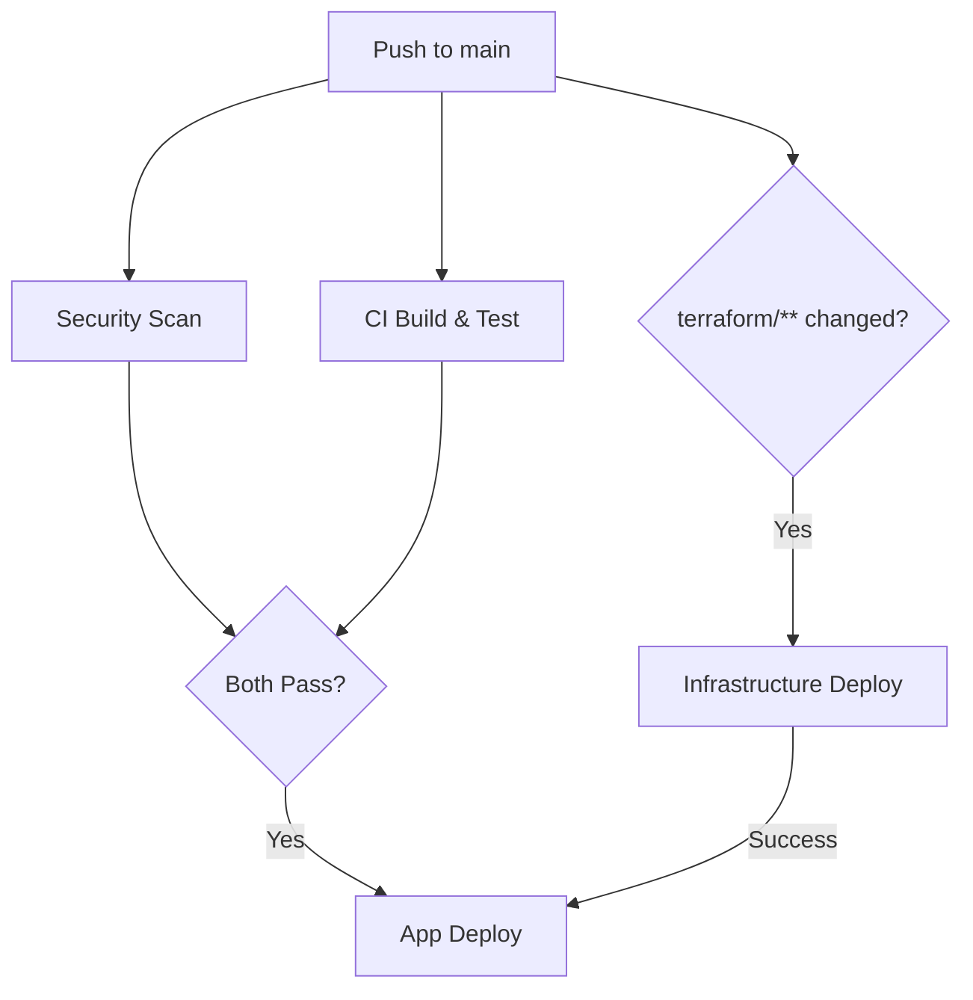

# DevOps Guide - CV Analyzer

**Audience**: DevOps engineers, deployment automation, CI/CD configuration

**Related Guides**:
- [QUICKSTART.md](../QUICKSTART.md) - Local Docker Compose setup
- [RUNNING_LOCALLY.md](../RUNNING_LOCALLY.md) - Local development with Azure
- [TERRAFORM.md](TERRAFORM.md) - Infrastructure as Code details
- [SECURITY.md](SECURITY.md) - Security best practices

---

## Table of Contents

1. [Quick Start](#quick-start)
2. [Multi-Environment Configuration](#multi-environment-configuration)
3. [CI/CD Pipeline](#cicd-pipeline)
4. [Manual Operations](#manual-operations)
5. [Troubleshooting](#troubleshooting)
6. [Common Deployment Issues](#common-deployment-issues)

---

## Quick Start

### Local Development
```bash
# Run full stack with docker-compose
docker-compose up -d

# URLs:
# Frontend: http://localhost:4200
# Backend API: http://localhost:5000
# SQL Server: localhost:1433
```

### Deploy to Azure
```bash
# 1. Deploy infrastructure (one-time setup)
cd terraform
terraform init
terraform apply -var-file="environments/dev.tfvars"

# 2. Deploy application (automated via GitHub Actions on push to main)
git push origin main
```

---

## Multi-Environment Configuration

### Problem
How to configure services to communicate across multiple environments (dev/test/prod) without hardcoding URLs?

### Solution: Container Apps Internal DNS

Azure Container Apps in the same environment can communicate using **internal DNS** with just the app name - no configuration needed!

### How It Works

**nginx.conf** (Static, works everywhere):
```nginx
location /api/ {
    proxy_pass http://ca-cvanalyzer-api:8080/api/;
}
```

**Container Apps Environment** provides internal DNS:
- Apps in same environment auto-resolve app names
- Format: `http://{app-name}:{port}`
- No external URLs needed
- Works identically across ALL environments

### Environment Resolution

The SAME configuration works everywhere:

| Environment | Frontend Request | Resolves To |
|-------------|-----------------|-------------|
| Dev | `http://ca-cvanalyzer-api:8080` | Dev API instance |
| Test | `http://ca-cvanalyzer-api:8080` | Test API instance |
| Prod | `http://ca-cvanalyzer-api:8080` | Prod API instance |

Azure provides **environment-scoped DNS** - same name resolves to correct instance automatically.

### Benefits

✅ Same Docker image across all environments  
✅ Zero configuration - no environment variables  
✅ No template files - static nginx.conf  
✅ No custom scripts - standard nginx behavior  
✅ Faster - internal communication (no external network)  
✅ Secure - traffic stays within Container Apps Environment  

### When NOT to Use Internal DNS

Use environment variables ONLY if:
- Apps in **different** Container Apps Environments
- Apps in **different** Azure regions
- Backend is not a Container App (e.g., App Service, AKS)

For our architecture (same environment), internal DNS is always simpler.

---

## CI/CD Pipeline

### Pipeline Architecture

#### Normal Code Changes (Most Common)
```
Push to main
  ↓
┌─────────────┐     ┌─────────────┐
│  Security   │     │  CI Build   │
│    Scan     │     │  & Test     │
│  (30 sec)   │     │  (2-3 min)  │
└──────┬──────┘     └──────┬──────┘
       │                   │
       └─────────┬─────────┘
                 │ Both PASS
         ┌───────▼────────┐
         │  Application   │
         │  Deployment    │
         │  (5-7 min)     │
         └────────────────┘

Total: ~8-10 minutes
```

#### Infrastructure Changes (Infrequent)
```
Push to main (terraform/** changed)
  ↓
┌────────────────────┐
│  Infrastructure    │
│  Deployment        │
│  (3-5 min)         │
└─────────┬──────────┘
          │ Success
  ┌───────▼────────┐
  │  Application   │
  │  Deployment    │
  │  (5-7 min)     │
  └────────────────┘

Total: ~8-12 minutes
```

### Workflows

#### 1. Security - Secret Scanning
**File**: `.github/workflows/security-scan.yml`

**Triggers**:
- Every push to main
- Every PR to main
- Manual dispatch

**Actions**:
- TruffleHog scan (verified secrets)
- GitLeaks scan
- **Blocks deployment** if secrets found

**Duration**: ~30 seconds

#### 2. CI Build and Test
**File**: `.github/workflows/ci.yml`

**Triggers**:
- Every push to main
- Every PR to main
- Manual dispatch

**Actions**:
- Build Angular frontend
- Build .NET backend
- Run unit tests
- Run integration tests

**Duration**: ~2-3 minutes

#### 3. Infrastructure Deployment
**File**: `.github/workflows/infra-deploy.yml`

**Triggers**:
- Push to main when `terraform/**` changes
- Manual dispatch (choose environment)

**Actions**:
- Terraform format check
- Terraform init/validate
- Terraform plan
- Terraform apply (main branch only)

**Duration**: ~3-5 minutes

**Path Filter**:
```yaml
paths:
  - 'terraform/**'
  - '.github/workflows/infra-deploy.yml'
```

#### 4. Application Deployment
**File**: `.github/workflows/app-deploy.yml`

**Triggers**:
- After Security + CI both pass
- After Infrastructure Deployment completes
- Manual dispatch (choose environment)

**Condition**:
```yaml
workflow_run:
  workflows: ["CI Build and Test", "Security - Secret Scanning", "Infrastructure Deployment"]
  types: [completed]
if: github.event.workflow_run.conclusion == 'success' || github.event_name == 'workflow_dispatch'
```

**Actions**:
- Build Docker images (parallel: frontend + backend)
- Push to Azure Container Registry
- Deploy to Container Apps (frontend + API)
- Health check verification

**Duration**: ~5-7 minutes

### Key Design Principles

✅ **Security First**: Secret scan blocks all deployments  
✅ **Fast Feedback**: Parallel execution where safe (Security + CI run together)  
✅ **Fail Fast**: Security and CI run early in pipeline  
✅ **Infrastructure Isolation**: Only runs when terraform/** changes  
✅ **Automatic Flow**: Infrastructure completion triggers app deployment  
✅ **Manual Override**: All workflows support workflow_dispatch  
✅ **Environment Safety**: Concurrency groups prevent conflicts  

### Workflow Dependencies



### Environment Protection

Configure in: **Repository Settings → Environments**

| Environment | Auto-Deploy | Approval Required | Reviewers |
|-------------|-------------|-------------------|-----------|
| dev | ✅ Yes | ❌ No | - |
| test | ❌ No | ✅ Yes | DevOps team |
| prod | ❌ No | ✅ Yes | DevOps + Tech Lead |

---

## Manual Operations

### Deploy Specific Environment

```bash
# Via GitHub UI
# Actions → Select workflow → Run workflow → Choose environment

# Via GitHub CLI
gh workflow run app-deploy.yml -f environment=prod
```

### View Pipeline Status

```bash
# List recent runs
gh run list

# View specific run
gh run view <run-id> --log

# Watch live
gh run watch
```

### Rollback Strategy

#### Application Rollback
```bash
# Option 1: Container Apps auto-rollback (health check fails)
# Previous revision stays active automatically

# Option 2: Manual rollback to previous revision
az containerapp revision list --name ca-cvanalyzer-api --resource-group rg-cvanalyzer-prod
az containerapp revision activate --name <previous-revision> --resource-group rg-cvanalyzer-prod
```

#### Infrastructure Rollback
```bash
cd terraform
terraform plan -var-file="environments/prod.tfvars"
terraform apply  # Applies previous state from version control
```

### Manual Deployment (Bypass CI/CD)

```bash
# 1. Build and push images
docker build -t acrcvanalizerprod.azurecr.io/cvanalyzer-frontend:manual ./frontend
docker build -t acrcvanalizerprod.azurecr.io/cvanalyzer-api:manual ./backend
az acr login --name acrcvanalizerprod
docker push acrcvanalizerprod.azurecr.io/cvanalyzer-frontend:manual
docker push acrcvanalizerprod.azurecr.io/cvanalyzer-api:manual

# 2. Update Container Apps
az containerapp update \
  --name ca-cvanalyzer-frontend \
  --resource-group rg-cvanalyzer-prod \
  --image acrcvanalizerprod.azurecr.io/cvanalyzer-frontend:manual
```

---

## Troubleshooting

### Pipeline Fails at Security Scan

**Symptom**: TruffleHog or GitLeaks reports secrets

**Solution**:
```bash
# 1. Check what was detected
gh run view <failed-run-id> --log

# 2. Remove secret from code
# 3. Add to .gitignore if needed
# 4. Update .github/security-guardrails.md exclusions if false positive

# 5. Rotate compromised secret
# Azure: Key Vault → Secrets → Rotate
```

### Pipeline Fails at CI Build

**Symptom**: Build or test failures

**Solution**:
```bash
# Run tests locally
cd backend
dotnet test

cd ../frontend
npm test

# Fix issues, commit, push
```

### Pipeline Fails at App Deployment

**Symptom**: Health check fails after deployment

**Solution**:
```bash
# Check container logs
az containerapp logs show \
  --name ca-cvanalyzer-api \
  --resource-group rg-cvanalyzer-dev \
  --tail 100

# Common issues:
# 1. Database connection string incorrect
# 2. AI Foundry endpoint not accessible
# 3. Container image not found in ACR

# Verify ACR authentication
az containerapp show \
  --name ca-cvanalyzer-api \
  --resource-group rg-cvanalyzer-dev \
  --query "properties.template.containers[0].image"
```

### Nginx "host not found in upstream"

**Symptom**: Frontend logs show DNS resolution error

**Solution**:
```nginx
# Verify nginx.conf uses internal DNS (not external URL)
location /api/ {
    proxy_pass http://ca-cvanalyzer-api:8080/api/;  # ✅ Correct
    # NOT: https://ca-cvanalyzer-api.azurecontainerapps.io/api/  # ❌ Wrong
}
```

### Infrastructure Apply Fails

**Symptom**: Terraform errors during apply

**Common Issues**:

1. **State Lock**:
```bash
# Force unlock (use with caution)
terraform force-unlock <lock-id>
```

2. **Resource Already Exists**:
```bash
# Import existing resource
terraform import azurerm_container_app.api /subscriptions/.../resourceGroups/.../providers/Microsoft.App/containerApps/ca-cvanalyzer-api
```

3. **SQL Password Missing**:
```bash
# Set Terraform variable for SQL admin password
# Format: TF_VAR_sql_admin_password (set at runtime; never commit real values)
# Or use GitHub secret: SQL_ADMIN_PASSWORD in workflow
```

### App Deploy Doesn't Trigger

**Symptom**: Security + CI pass but app doesn't deploy

**Possible Causes**:

1. **Workflow condition failed**:
```yaml
# Check if condition is correct
if: github.event.workflow_run.conclusion == 'success' || github.event_name == 'workflow_dispatch'
```

2. **Wrong branch**:
```yaml
# App deploy only triggers on main
branches: [ main ]
```

3. **Manual trigger**:
```bash
# Force deployment
gh workflow run app-deploy.yml -f environment=dev
```

---

## Best Practices Summary

### Configuration
✅ Use internal DNS for same-environment communication  
✅ Store secrets in Azure Key Vault or GitHub Secrets  
✅ Never commit secrets to repository  

### CI/CD
✅ Security scan blocks deployment  
✅ Tests must pass before deployment  
✅ Infrastructure changes isolated from app changes  
✅ Manual approval for prod deployments  

### Monitoring
✅ Check Container App logs after deployment  
✅ Verify health endpoints return 200  
✅ Monitor Application Insights for errors  

### Infrastructure
✅ Use Terraform for infrastructure as code  
✅ Version control all infrastructure changes  
✅ Test in dev before promoting to prod  
✅ Use resource locks in production  

---

## Reference

### URLs by Environment

| Environment | Frontend | Backend API |
|-------------|----------|-------------|
| Dev | https://ca-cvanalyzer-frontend.wittystone-424eb7de.swedencentral.azurecontainerapps.io | https://ca-cvanalyzer-api.wittystone-424eb7de.swedencentral.azurecontainerapps.io |
| Test | (Deploy to create) | (Deploy to create) |
| Prod | (Deploy to create) | (Deploy to create) |

### Key Files

| Purpose | File Path |
|---------|-----------|
| CI Build | `.github/workflows/ci.yml` |
| Security Scan | `.github/workflows/security-scan.yml` |
| Infrastructure | `.github/workflows/infra-deploy.yml` |
| App Deploy | `.github/workflows/app-deploy.yml` |
| Terraform Dev | `terraform/environments/dev.tfvars` |
| Nginx Config | `frontend/nginx.conf` |
| Docker Compose | `docker-compose.yml` |

### Useful Commands

```bash
# GitHub CLI
gh workflow list
gh run list --workflow=app-deploy.yml
gh run watch

# Azure CLI
az containerapp list --resource-group rg-cvanalyzer-dev
az containerapp logs tail --name ca-cvanalyzer-api --resource-group rg-cvanalyzer-dev
az acr repository list --name acrcvanalyzerdev

# Terraform
terraform plan -var-file="environments/dev.tfvars"
terraform apply -var-file="environments/dev.tfvars"
terraform state list
terraform output

# Docker
docker-compose up -d
docker-compose logs -f api
docker-compose down
```
